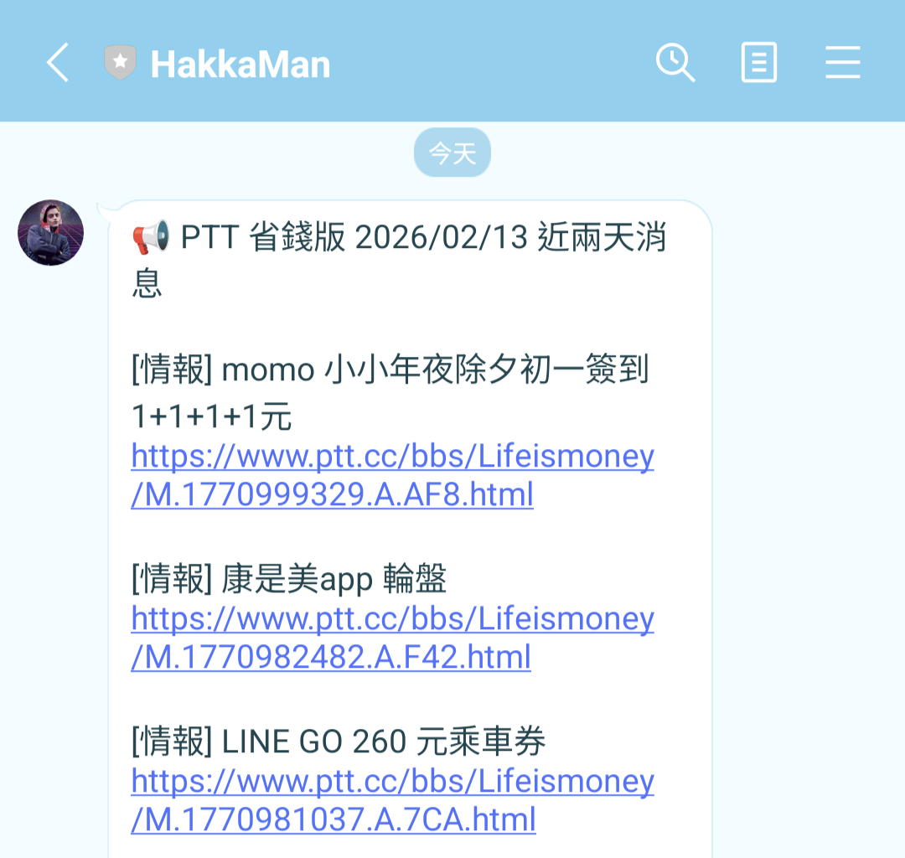

# Hakkaman - PTT 省錢版每日通知 Line Bot

每天自動使用 RSS 抓取 [PTT Lifeismoney 省錢版](https://www.ptt.cc/bbs/Lifeismoney/) 文章，並透過 LINE Bot 發送通知。



## 功能

- 使用 [RSS](http://rss.ptt.cc/Lifeismoney.xml) 抓取 PTT 省錢版最新文章
- 過濾公告、集中串等非優惠資訊
- 透過 LINE 官方帳號發送每日通知
- GitHub Actions 每天定時執行（台灣時間早上 7:00 ）

## Built With


## 專案結構

```
hakkaman/
├── app.py          # 主程式進入點，串接爬蟲與 LINE Bot
├── crawler.py      # PTT 爬蟲與文章格式化
├── line.py         # LINE Bot 發送訊息功能
├── requirements.txt
├── .env.example
└── .github/
    └── workflows/
        └── daily-notify.yml  # GitHub Actions 設定
```

## 安裝

1. clone repo

```bash
git clone https://github.com/JuneLin2001/hakkaman.git
cd hakkaman
```

2. 設定 python venv
3. 安裝套件 `pip install -r requirements.txt`

## 設定環境變數

參考 `.env.example` 建立 `.env` 檔案：

```env
CHANNEL_ACCESS_TOKEN=你的 Line channel access token
USER_ID=你的 Line user ID
WORKER_URL=Cloudflare Worker URL
```

## 使用

### 本機執行

```bash
python app.py
```

### GitHub Actions 自動排程

1. 前往 GitHub repo → **Settings** → **Secrets and variables** → **Actions**
2. 新增以下 Secrets：
   - `CHANNEL_ACCESS_TOKEN`
   - `USER_ID`
   - `WORKER_URL`
3. 推送至 GitHub 後會每天自動執行
4. 也可以在 **Actions** 頁面手動觸發 `workflow_dispatch`
